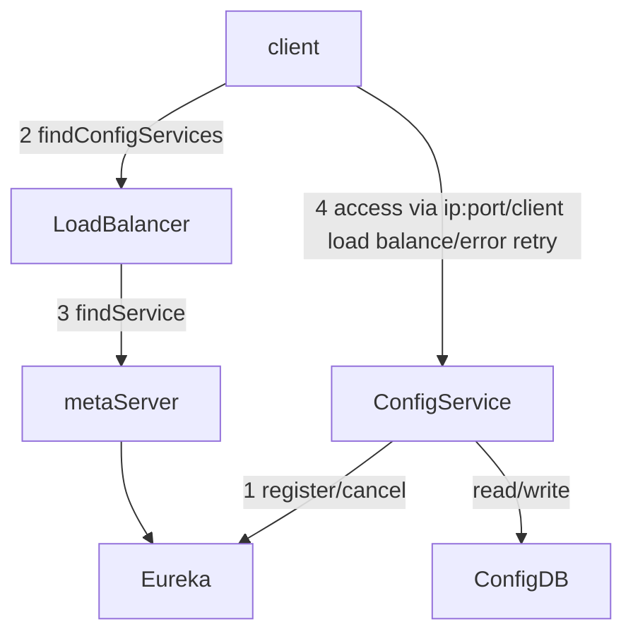

##### Markdown

```markdown
# h1
###### h6

**Bold**	__Bold__

[TOC] :目录

*倾斜* _倾斜_

~~Delete~~

<u>Underline</u> :下划线

Ordered List :数字不能省略但可无序，点号之后的空格不能少。建立多级列表时，每个子级别都要比上个级别前面多打2个以上空格
1. Item-1
   1. Item-1-1

Unordered List :符号之后的空格不能少，-、+、*效果一样，在嵌套列表中可以循环使用
- Item-1
  - Item-1-1
 
Links
- lnlinks
[This link](http://example.net/) has no title attribute.
- Reference
[ref]: http://example.com/ "Optional Title Here"

Auto link
<http://www.baidu.com>

image :大小必须使用 


文字引用
>
>>
>>>

转义 ： \

代码块 : `` or ``` ```

分割线 ： 在一行中使用三个或三个以上的*、-或_可以添加分隔线，中间插入空格，但是不能有其他字符

脚注：
Footnotes[^1] 
[^1]: This is a footnote

数学表达式：使用$符号包裹Tex命令，例如：$lim_{x \to \infty} \ exp(-x)=0$

下标：~包裹 H~2~O

上标：y^2^=4

数学表达式块：
$$\mathbf{V}_1 \times \mathbf{V}_2 =  \begin{vmatrix} \mathbf{i} & \mathbf{j} & \mathbf{k} \\\frac{\partial X}{\partial u} &  \frac{\partial Y}{\partial u} & 0 \\\frac{\partial X}{\partial v} &  \frac{\partial Y}{\partial v} & 0 \\\end{vmatrix}$$

```



~~~flow
```flow
st=>start: Start|past:>http://www.google.com[blank]
e=>end: End:>http://www.google.com
op1=>operation: My Operation|past
op2=>operation: Stuff|current
sub1=>subroutine: My Subroutine|invalid
cond=>condition: Yes 
or No?|approved:>http://www.baidu.com
c2=>condition: Good idea|rejected
io=>inputoutput: catch something...|request

st->op1(right)->cond
cond(yes, right)->c2
cond(no)->sub1(left)->op1
c2(yes)->io->e
c2(no)->op2->e
```　
~~~


[Markdown语法]: https://www.jianshu.com/p/bb1c4fb0fbc4
[Topora md语法]: https://www.jianshu.com/p/092de536d948

[ 流程图，时序图，甘特图 ]:https://www.jianshu.com/p/a9ff5a9cdb25
[  md高级技巧  ]:https://www.runoob.com/markdown/md-advance.html
[  mdguide ]:https://www.markdownguide.org/