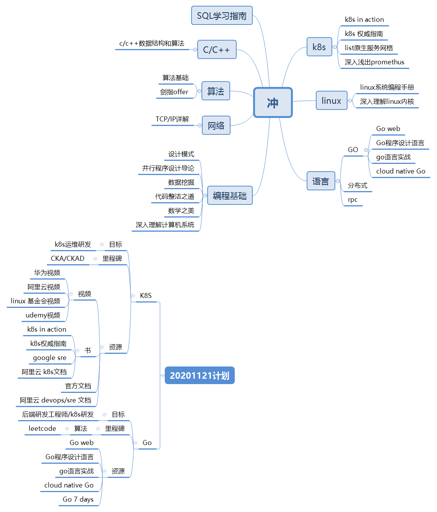

##### codeLife

```
计算机原理
数据结构
算法
设计模式

分布式、多线程、异步及高性能设计
socket编程

微服务、consul
grpc

```

英文读写

21年计划

```
k8s cka ckad
```


---

实际操作

k8s 

```
cka:	18
ckad: 9
---
9课
```

leetcode

```
5/周
---
60题
```

Go

```
Go程序设计语言
---

```

