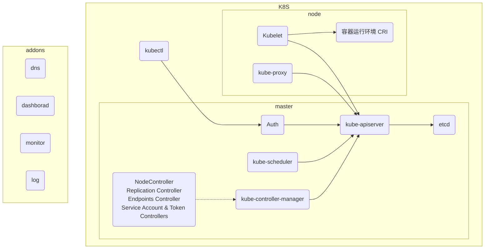

# K8S in action


```shell

```

##### 流程图

```mermaid
graph TD
    subgraph 4
      kl(kubelet<br>watch被调度到本节点的pod<br>执行生命周期动作)-->|0 发起<br>watch Pod |api4(API-server) 
      api4-->|12 上报事件<br>Pod Bound/updated|kl
			etcd4(ETCD)-->|11 上报事件 Pod Bound/updated|api4
    end
    subgraph 3
      sc(scheduler<br>list & watch集群中的node,供调度时使用<br>watch未调度的pod,进行策略调度)-->|0 发起<br>watch Pod |api3
      api3-->|8 上报事件<br>Pod created|sc
      sc-->|9 更新Pod<br>按调度结果绑定node|api3
      api3-->|10 更新Pod|etcd3(ETCD)
      api3(API-server)-->|7 上报事件<br> Pod Created|etcd3
    end
    subgraph 2
      cm(Controller Mgr<br>watch各类Set,处理生命周期事件<br>定期list做同步处理,保证最终一致)-->|0 发起<br>watch ReplicaSet|api2
      cm-->|5 创建Pod|api2(API-server)
      api2-->|4 上报事件<br>ReplicaSet Created|cm
      api2-->|6 创建Pod|etcd2
      etcd2(ETCD)-->|3 上报事件<br>ReplicaSet Created |api2
    end
    
    subgraph 1
      ctl(kubectl)-->|1 创建ReplicaSet|api(API-server)
      api-->|2 创建ReplicaSet |etcd(ETCD)
    end

```





##### kubeadm 搭建多节点k8s集群

```bash
# 基础环境 Centos 7.3
# 关闭selinux
setenforce 0
[root@master ~]# cat /etc/selinux/config 

# This file controls the state of SELinux on the system.
# SELINUX= can take one of these three values:
#     enforcing - SELinux security policy is enforced.
#     permissive - SELinux prints warnings instead of enforcing.
#     disabled - No SELinux policy is loaded.
SELINUX=disabled
# SELINUXTYPE= can take one of three two values:
#     targeted - Targeted processes are protected,
#     minimum - Modification of targeted policy. Only selected processes are protected. 
#     mls - Multi Level Security protection.
SELINUXTYPE=targeted 

# 关闭防火墙
systemctl disable firewalld && systemctl stop firewalld

# 配置 ali yum源
cat <<EOF > kubernetes.repo
[kubernetes]
name=Kubernetes
baseurl=https://mirrors.aliyun.com/kubernetes/yum/repos/kubernetes-el7-x86_64
enabled=1
gpgcheck=1
repo_gpgcheck=1
gpgkey=https://mirrors.aliyun.com/kubernetes/yum/doc/yum-key.gpg https://mirrors.aliyun.com/kubernetes/yum/doc/rpm-package-key.gpg
EOF
mv kubernetes.repo /etc/yum.repos.d/k8s.repo 

# 安装基础组件
yum install -y docker kubelet kubeadm kubectl kubernetes-cni

# 启动docker & kubelet
systemctl enable docker && systemctl start docker
systemctl enable kubelet && systemctl start kubelet

# 修改网络转发
sysctl -w net.bridge.bridge-nf-call-iptables=1
echo "net.bridge.bridge-nf-call-iptables=1" > /etc/sysctl.d/k8s.conf

# 关闭swap
swapoff -a && sed -i '/ swap / s/^/#/' /etc/fstab

# 重启使各种配置永久生效
reboot

# 修改hostname
hostnamectl --static set-hostname node1.k8s

# dns配置 /etc/hostss
192.168.64.138 master.k8s
192.168.64.139 node1.k8s
192.168.64.140 node2.k8s

# 起集群
nohup kubeadm init --image-repository registry.aliyuncs.com/google_containers --ignore-preflight-errors=Swap
# 指定配置文件
export KUBECONFIG=/etc/kubernetes/admin.conf

# 命令检验
kubectl get po -n kube-system

# 其他节点接入(from kubeadm init，注意保留)
kubeadm join 192.168.199.214:6443 --token $token \
    --discovery-token-ca-cert-hash sha256:$sha

## 补充
[root@master kubelet.service.d]# cat  /usr/lib/systemd/system/kubelet.service.d/10-kubeadm.conf 
# Note: This dropin only works with kubeadm and kubelet v1.11+
[Service]
Environment="KUBELET_KUBECONFIG_ARGS=--bootstrap-kubeconfig=/etc/kubernetes/bootstrap-kubelet.conf --kubeconfig=/etc/kubernetes/kubelet.conf"
Environment="KUBELET_CONFIG_ARGS=--config=/var/lib/kubelet/config.yaml"
# 以下一行为添加，似乎并没有报错？解决swap问题
Environment="KUBELET_SYSTEM_PODS_ARGS=--pod-manifest-path=/etc/kubernetes/manifests --allow-privileged=true --fail-swap-on=false"
# This is a file that "kubeadm init" and "kubeadm join" generates at runtime, populating the KUBELET_KUBEADM_ARGS variable dynamically
EnvironmentFile=-/var/lib/kubelet/kubeadm-flags.env
# This is a file that the user can use for overrides of the kubelet args as a last resort. Preferably, the user should use
# the .NodeRegistration.KubeletExtraArgs object in the configuration files instead. KUBELET_EXTRA_ARGS should be sourced from this file.
EnvironmentFile=-/etc/sysconfig/kubelet
ExecStart=
ExecStart=/usr/bin/kubelet $KUBELET_KUBECONFIG_ARGS $KUBELET_CONFIG_ARGS $KUBELET_KUBEADM_ARGS $KUBELET_EXTRA_ARGS

# kubelet 无法启动问题
[root@master ~]# cat /usr/lib/systemd/system/docker.service
[Unit]
Description=Docker Application Container Engine
Documentation=http://docs.docker.com
After=network.target
Wants=docker-storage-setup.service
Requires=docker-cleanup.timer

[Service]
Type=notify
NotifyAccess=main
EnvironmentFile=-/run/containers/registries.conf
EnvironmentFile=-/etc/sysconfig/docker
EnvironmentFile=-/etc/sysconfig/docker-storage
EnvironmentFile=-/etc/sysconfig/docker-network
Environment=GOTRACEBACK=crash
Environment=DOCKER_HTTP_HOST_COMPAT=1
Environment=PATH=/usr/libexec/docker:/usr/bin:/usr/sbin
ExecStart=/usr/bin/dockerd-current \
          --add-runtime docker-runc=/usr/libexec/docker/docker-runc-current \
          --default-runtime=docker-runc \
          # kubelet与docker 驱动不同，修改docker驱动为cgroupfs
          --exec-opt native.cgroupdriver=cgroupfs \
          --userland-proxy-path=/usr/libexec/docker/docker-proxy-current \
          --init-path=/usr/libexec/docker/docker-init-current \
          --seccomp-profile=/etc/docker/seccomp.json \
          $OPTIONS \
          $DOCKER_STORAGE_OPTIONS \
          $DOCKER_NETWORK_OPTIONS \
          $ADD_REGISTRY \
          $BLOCK_REGISTRY \
          $INSECURE_REGISTRY \
          $REGISTRIES
ExecReload=/bin/kill -s HUP $MAINPID
LimitNOFILE=1048576
LimitNPROC=1048576
LimitCORE=infinity
TimeoutStartSec=0
Restart=on-abnormal
KillMode=process

[Install]
WantedBy=multi-user.target
```

