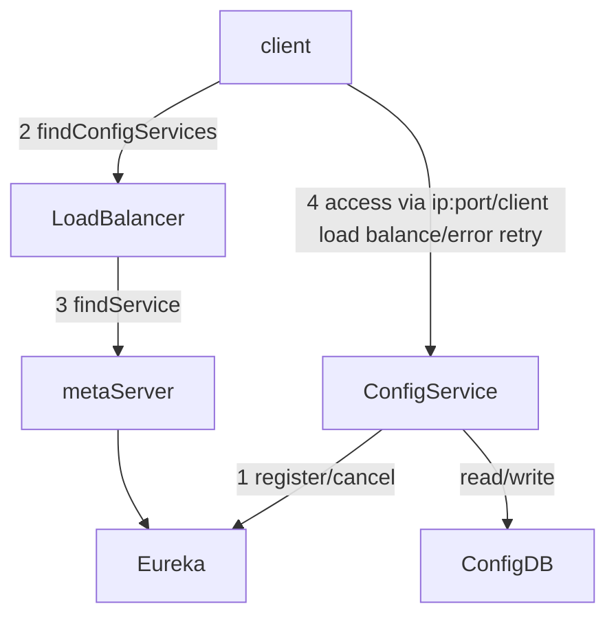

# K8S in action

```mermaid
graph TB
　　client-->|2 findConfigServices|LoadBalancer;
　　LoadBalancer-->|3 findService|metaServer;
　　metaServer-->Eureka;
　　client-->|4 access via ip:port/client load balance/error retry|ConfigService;
　　ConfigService-->|1 register/cancel|Eureka;
　　ConfigService-->|read/write|ConfigDB;
```