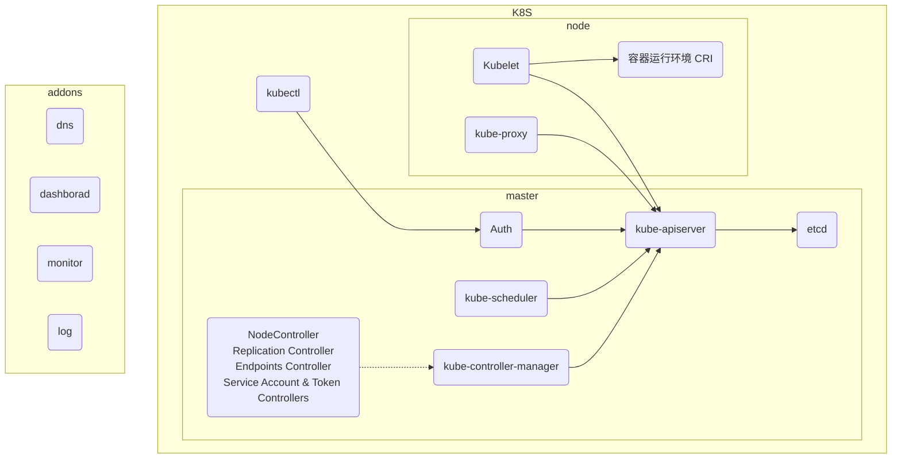

# K8S in action


```shell

```

##### 流程图

```mermaid
graph TD
    subgraph 4
      kl(kubelet<br>watch被调度到本节点的pod<br>执行生命周期动作)-->|0 发起<br>watch Pod |api4(API-server) 
      api4-->|12 上报事件<br>Pod Bound/updated|kl
			etcd4(ETCD)-->|11 上报事件 Pod Bound/updated|api4
    end
    subgraph 3
      sc(scheduler<br>list & watch集群中的node,供调度时使用<br>watch未调度的pod,进行策略调度)-->|0 发起<br>watch Pod |api3
      api3-->|8 上报事件<br>Pod created|sc
      sc-->|9 更新Pod<br>按调度结果绑定node|api3
      api3-->|10 更新Pod|etcd3(ETCD)
      api3(API-server)-->|7 上报事件<br> Pod Created|etcd3
    end
    subgraph 2
      cm(Controller Mgr<br>watch各类Set,处理生命周期事件<br>定期list做同步处理,保证最终一致)-->|0 发起<br>watch ReplicaSet|api2
      cm-->|5 创建Pod|api2(API-server)
      api2-->|4 上报事件<br>ReplicaSet Created|cm
      api2-->|6 创建Pod|etcd2
      etcd2(ETCD)-->|3 上报事件<br>ReplicaSet Created |api2
    end
    
    subgraph 1
      ctl(kubectl)-->|1 创建ReplicaSet|api(API-server)
      api-->|2 创建ReplicaSet |etcd(ETCD)
    end

```





##### kubeadm 搭建多节点k8s集群

```bash
# 基础环境 Centos 7.3
# 关闭selinux
setenforce 0
vi /etc/selinux/config
# 关闭防火墙
systemctl disable firewalld && systemctl stop firewalld
# 配置 ali yum源

# 安装基础组件
yum install -y docker kubelet kubeadm kubectl kubernetes-cni
# 启动docker & kubelet
systemctl enable docker && systemctl start docker
systemctl enable kubelet && systemctl start kubelet
# 修改网络转发
sysctl -w net.bridge.bridge-nf-call-iptables=1
echo "net.bridge.bridge-nf-call-iptables=1" > /etc/sysctl.d/k8s.conf
# 关闭swap
swapoff -a && sed -i '/ swap / s/^/#/' /etc/fstab
# 
reboot
# 
hostnamectl --static set-hostname node1.k8s
# 路由配置
192.168.64.138 master.k8s
192.168.64.139 node1.k8s
192.168.64.140 node2.k8s
#
kubeadm init
#
export KUBECONFIG=/etc/kubernetes/admin.conf
kubectl get po -n kube-system
```

